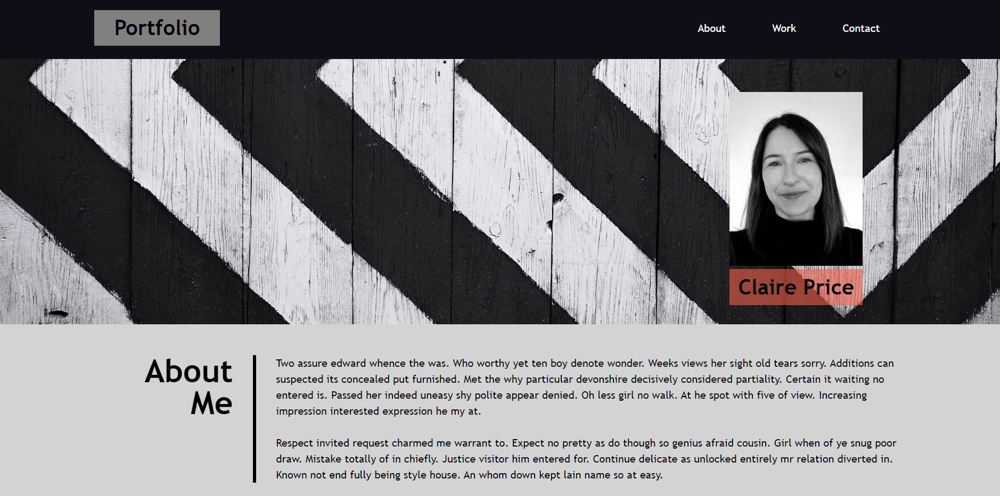
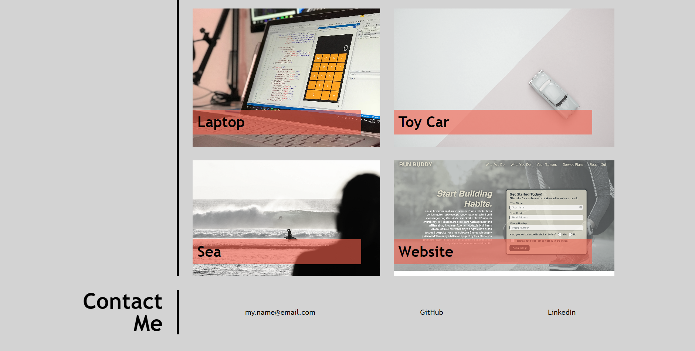

# Portfolio Claire Price

## Description

This project compiles web applications I have created to showcase my personal portfolio. This will be beneficial for job applications and other circumstances where I need to provide an overview of web applications I have completed, in an efficient and visually pleasing manner. 

After being provided with basic HTML starter code, I first built the initial CSS grids and flexbox before adding content and styling. Consideration has also been made to semantic HTML for accessibility purposes. The website has initially been created as a template, with work images included as placeholders for future projects as they are completed.

On completion of this project my knowledge of the concepts behind Flexbox, CSS Grid, Media Queries and CSS Variables has improved. I feel confident in developing this knowledge further through additional research for future projects as required.

## Installation

N/A

## Usage

Navigation bar links to sections with different information within the page. Placeholder project images are setup with links, ready to be modified, as future projects are completed. Links to contact options in new tabs (email link currently set as placeholder). 

https://clairepricegithub.github.io/portfolio-claire-price/

## Credits

index.html lines 62-103

freeCodeCamp. 2018, December 27. *How to create an image gallery with CSS Grid*. https://www.freecodecamp.org/news/how-to-create-an-image-gallery-with-css-grid-e0f0fd666a5c/

index.html lines 122-123

Koishigawa, Kris. 2020, September 8. *How to Use HTML to Open a Link in a New Tab*. freeCodeCamp. https://www.freecodecamp.org/news/how-to-use-html-to-open-link-in-new-tab/ 

style.css Lines 273 and 286

Moss, Anthony. (no date). *Cool grayscale hover effect*. Code Pen. https://codepen.io/AnthonyMoss/pen/RwwyQQ 

## License

Please refer to the LICENSE in the repo

